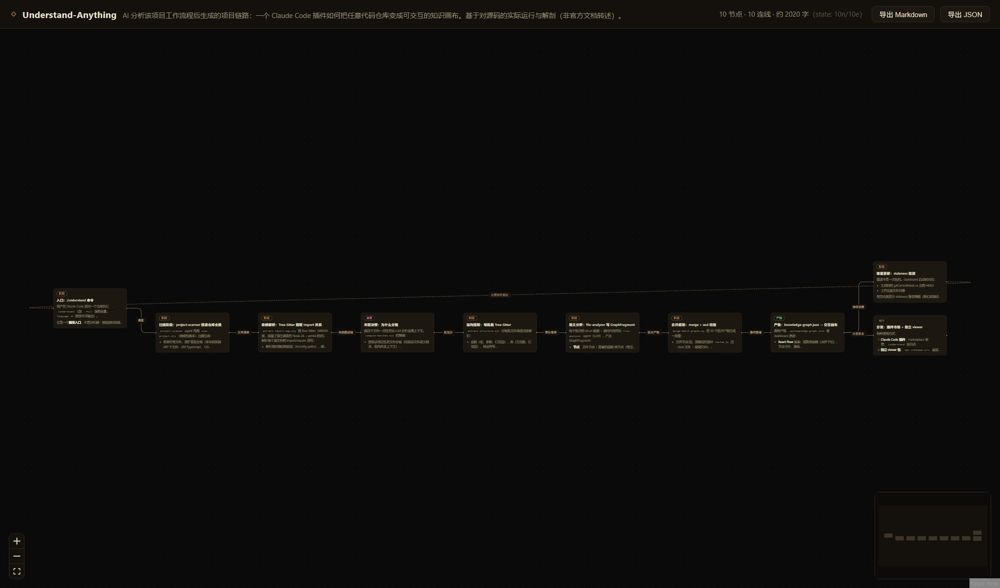

# Flow Canvas

文字即节点，链路即画布——AI 分析代码项目，产出**项目流程链路文件**（`flow.json`），在无限画布上以文字节点浏览，一键导出整链 Markdown。

> 不是代码符号图谱：节点是自然语言段落（阶段/决策/产物），边是推导关系。



## 快速开始

```powershell
pnpm install
pnpm dev
# 浏览器打开 http://127.0.0.1:5273/
```

- `http://127.0.0.1:5273/` → 样例（Flow Canvas 自己的开发链路）
- `http://127.0.0.1:5273/?file=understand-anything.json` → 真实项目链路（Understand-Anything 工作流程）

## 切换与导入项目

| 操作 | 方式 |
|------|------|
| 切换项目 | 顶栏下拉：列出 `data/` 目录全部链路文件（文件名 — 项目名），选中即切换 |
| 导入项目 | 顶栏「导入项目」按钮选择本地 `flow.json`，或直接把 `.json` 文件拖进画布 |
| 导入后行为 | 立即布局展示；出现在下拉的「本次会话导入」分组；URL 不带 `file` 参数（会话级，刷新后回落到默认文件） |

切换 `data/` 项目时 URL 自动同步为 `?file=<name>.json`，刷新保持当前项目；`data/` 目录新增文件无需改代码，刷新即出现在下拉中。

## 画布操作

| 操作 | 方式 |
|------|------|
| 看全文 | 点击节点卡片 → 右侧面板 |
| 平移/缩放 | 拖拽空白处 / 滚轮 |
| 复位视图 | 左下角 ⛶ |
| 切换项目 | 顶栏下拉（见上文「切换与导入项目」） |
| 导入项目 | 顶栏「导入项目」或拖入 `.json` |
| 导出 | 顶栏「导出 Markdown / 导出 JSON」 |

## 生成新项目的链路

### 方式一：安装 Skill，让 AI 干活（推荐）

本仓库自带 `skills/flow-canvas/`——一套完整的分析方法论：五步分析流程、格式规范、质量红线、自校验脚本。任何 DSH 会话装载后，只需一句"分析这个项目，生成链路"，AI 就知道怎么干。

**安装**（任选其一）：

```powershell
# 用户级（所有项目可用，推荐）
Copy-Item -Recurse <本仓库路径>\skills\flow-canvas "$env:USERPROFILE\.dsh\skills\flow-canvas"

# 项目级（仅当前项目可用）
Copy-Item -Recurse <本仓库路径>\skills\flow-canvas <你的项目>\.dsh\skills\flow-canvas
```

**验证**：新开会话（或重启 DSH），技能列表出现 `flow-canvas` 即成功；也可 `skill_search flow` 确认。

**使用**：对话里直接说——

> 用 flow-canvas 分析 D:\path\to\某项目，生成流程链路

AI 会读源码 → 提炼叙事链 → 写 `data/<name>.json` → 跑校验脚本 → 给你画布 URL。

### 方式二：手写 JSON

格式规范见 [`docs/flow-format.md`](docs/flow-format.md)，写完放 `data/`，用校验脚本自检：

```bash
node skills/flow-canvas/scripts/validate.mjs data/<name>.json
```

## flow.json 是什么

三段结构：`project` 元数据 + `nodes`（文字节点：id/title/body/kind）+ `edges`（推导关系：source/target/label）。**画布只是它的视图**——导出的 Markdown 离开画布仍完整可读，数据本身可提交进 git。

- 节点 `id` 交付后永不更改（未来"人工标记不清晰 → AI 修订"闭环的锚点）
- 环是合法的（如"增量检测→重跑"循环），画布用虚线弧渲染回边

## 项目结构

```
flow-canvas/
├── data/                      # 链路文件（画布从这里加载）
│   ├── flow.json              # 样例：本项目的开发链路
│   └── understand-anything.json
├── docs/flow-format.md        # 格式规范 v1
├── skills/flow-canvas/        # AI 分析技能（可安装到自己的技能目录）
│   ├── SKILL.md               # 分析方法论 + 格式规范 + 质量红线
│   └── scripts/validate.mjs   # flow.json 结构校验器
└── src/                       # 画布应用（Vite + React + React Flow + dagre）
```

## 技术栈

Vite · React 18 · TypeScript · @xyflow/react（React Flow v12）· @dagrejs/dagre（分层布局）· react-markdown

## Roadmap

- [x] MVP：生成 → 画布浏览 → 导出 Markdown
- [ ] 节点标记"不清晰" → AI 修订 → 级联更新下游（`id` 锚点已预留）
